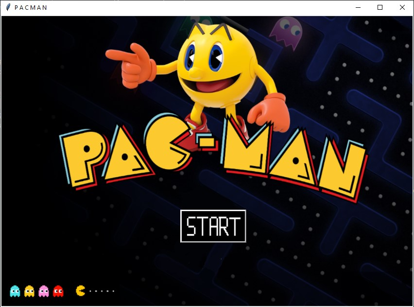
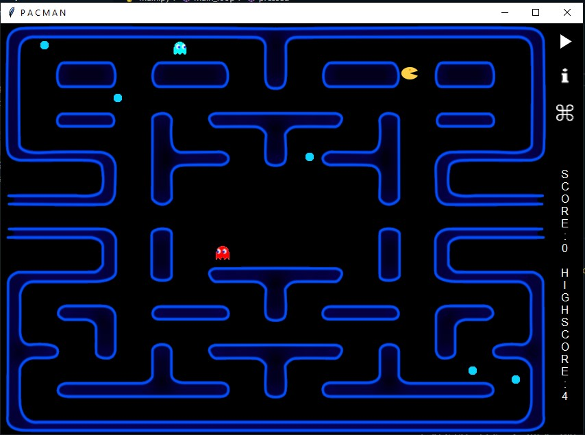
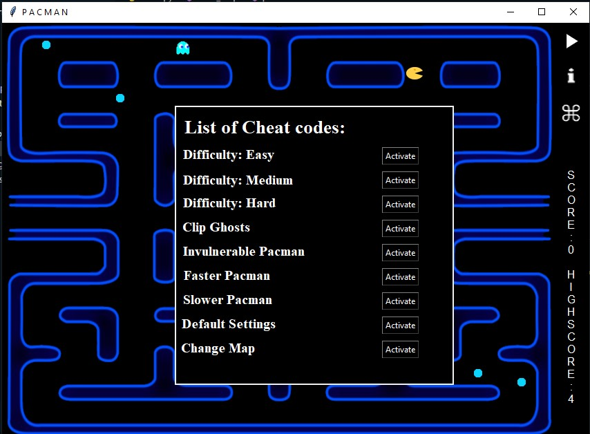

# Pacman Game

## Table of Contents

- [Description](#description)
- [Screenshots](#screenshots)
- [Installation](#installation)
- [Usage](#usage)
- [Contributing](#contributing)
- [License](#license)

## Description

This is a classic Pacman game implemented in Python. The game features a start menu where players can choose to start the game, view the game grid, and access a cheat code list. The game grid is where all the action happens, and players control Pacman to eat pellets, avoid ghosts, and clear the maze. The cheat code list provides additional features and shortcuts for an enhanced gaming experience.

## Screenshots

1. Start Menu
   

2. Game Grid
   

3. Cheat Code List
   

## Installation

To play the Pacman Game on your local machine, follow these steps:

1. Clone the repository to your local machine using the following command:

```bash
git clone https://github.com/myameen123/Packman-game-semester-project.git
```

2. Navigate to the project directory:

```bash
cd pacman-game
```

3. Ensure you have Python installed (version 3.6 or above).

## Usage

1. Run the main.py file to start the game:

```bash
python main.py
```

2. Use the arrow keys to control Pacman: up arrow (↑) for moving up, down arrow (↓) for moving down, left arrow (←) for moving left, and right arrow (→) for moving right.

3. Your objective is to navigate Pacman through the maze, eat all the pellets, and avoid the ghosts. Eating power pellets will allow Pacman to temporarily eat the ghosts.

4. To access the cheat codes, navigate to the "Cheat Code List" option in the start menu and follow the provided instructions.
